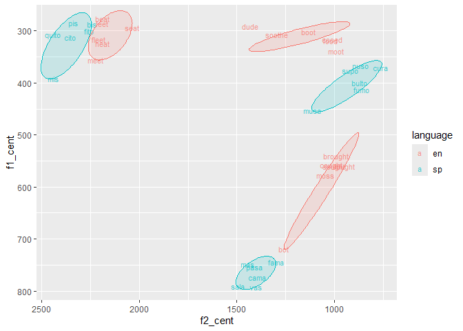

# Programming assignment 3

2025-10-30

## Load libraries & data

``` r
library(here)
```

    here() starts at C:/Users/rober/Desktop/pa_3

``` r
library(tidyverse)
```

    Warning: package 'ggplot2' was built under R version 4.5.1

    ── Attaching core tidyverse packages ──────────────────────── tidyverse 2.0.0 ──
    ✔ dplyr     1.1.4     ✔ readr     2.1.5
    ✔ forcats   1.0.0     ✔ stringr   1.5.1
    ✔ ggplot2   4.0.0     ✔ tibble    3.2.1
    ✔ lubridate 1.9.4     ✔ tidyr     1.3.1
    ✔ purrr     1.0.4     

    ── Conflicts ────────────────────────────────────────── tidyverse_conflicts() ──
    ✖ dplyr::filter() masks stats::filter()
    ✖ dplyr::lag()    masks stats::lag()
    ℹ Use the conflicted package (<http://conflicted.r-lib.org/>) to force all conflicts to become errors

``` r
library(ggforce)
```

    Warning: package 'ggforce' was built under R version 4.5.1

``` r
dat <- read_csv(here("data","vowel_data.csv"))
```

    Rows: 36 Columns: 17
    ── Column specification ────────────────────────────────────────────────────────
    Delimiter: ","
    chr  (4): id, item, vowel, language
    dbl (13): f1_cent, f2_cent, tl, f1_20, f1_35, f1_50, f1_65, f1_80, f2_20, f2...

    ℹ Use `spec()` to retrieve the full column specification for this data.
    ℹ Specify the column types or set `show_col_types = FALSE` to quiet this message.

## Section 7

The following code is from the Praat script `extract_vals.praat`.

    vonset = Get starting point: 2, 2
    voffset = Get end point: 2, 2
    durationV = voffset - vonset
    per20 = vonset + (durationV * 0.20)
    per35 = vonset + (durationV * 0.35)
    per50 = vonset + (durationV * 0.50)
    per65 = vonset + (durationV * 0.65)
    per80 = vonset + (durationV * 0.80)

This code first finds the target vowel’s onset and offset, and then
calculates the vowel duration. From there, it calculates five points
within the vowel at 20%, 35%, 50%, 65%, and 80% of the vowel duration.
It does this by adding the vowel onset (the “real” time at which the
vowel begins in the audio file) to 20%/35%/50%/65%/80% of the vowel’s
duration. I use fake numbers below to demonstrate finding where to
extract values for the 20% point:

    vonset = 1500
    voffset = 1550
    durationV = 50

    per20 = vonset + (durationV * 0.20)
    per20 = 1500 + (50 * 0.20)
    per20 = 1500 + 10
    per20 = 1510

The vowel onset is at 1500 seconds into the audio file, and the vowel
offset at 1550 seconds. The duration of the vowel is thus 50 seconds. To
get the 20% point of the vowel, we must calculate 20% of the duration
(50 \* 0.20 = 10). Then we must add that value to the vowel onset (1500)
so that we can find the point in the audio file at which to extract our
desired values.

In pa_2, we had a “master” .wav file that we divided into various files.
In this assignment, we worked only with the “master” file throughout the
entire procedure. By working with a single master file, we can save time
by not needing to go on opening and closing various files, which can
become burdensome if there are many files. However, if the master file
becomes too large, it can become unwieldy to work with, especially in
Praat. A mistake at some point within the .TextGrid, for example, may
become very hard to identify.

## Descriptive Stats

``` r
dat %>%
  group_by(vowel,language) %>%
  summarize(f1_cent_avg = mean(f1_cent),
            f1_cent_sd = sd(f1_cent),
            f2_cent_avg = mean(f2_cent),
            f2_cent_sd = sd(f2_cent),
            tl_avg = mean(tl),
            tl_sd = sd(tl))
```

    `summarise()` has grouped output by 'vowel'. You can override using the
    `.groups` argument.

    # A tibble: 6 × 8
    # Groups:   vowel [3]
      vowel language f1_cent_avg f1_cent_sd f2_cent_avg f2_cent_sd tl_avg tl_sd
      <chr> <chr>          <dbl>      <dbl>       <dbl>      <dbl>  <dbl> <dbl>
    1 a     en              586.       66.6       1042.      110.    222.  56.3
    2 a     sp              767.       21.3       1408.       64.4   222.  25.8
    3 i     en              309.       29.4       2171.       67.8   366. 193. 
    4 i     sp              314.       39.4       2346.       85.5   249. 177. 
    5 u     en              312.       16.7       1146.      180.    395. 291. 
    6 u     sp              396.       32.7        898.      117.    388. 383. 

## Plots

``` r
# Trajectory length as a function of vowel and language
dat %>%
  ggplot() +
  aes(x = vowel, y = tl, color = language) +
  geom_boxplot()
```


``` r
# F1 as a function of vowel and language
dat %>%
  ggplot() +
  aes(x = f1_cent, fill = language) +
  facet_wrap(. ~ vowel) +
  geom_histogram(alpha=.5)
```

    `stat_bin()` using `bins = 30`. Pick better value `binwidth`.


``` r
# F2 as a function of vowel and language
dat %>%
  ggplot() +
  aes(x = f2_cent, fill = language) +
  facet_wrap(. ~ vowel) +
  geom_histogram(alpha=.5)
```

    `stat_bin()` using `bins = 30`. Pick better value `binwidth`.


For the spectral centroids plot, I noticed that the F2 values for my
vowel \[i\] from ‘quito’ was VERY wrong (it was giving me f2 values of
about 1200 Hz, when it should’ve been about 2400 Hz as I saw in Praat).
I decided to consult ChatGPT and it suggested modifying this part of the
Praat script:

    do ("To Formant (burg)...", 0, 5, 5500, 0.025, 30)

Originally, it had a ceiling of 4800; I modified it to 5500. This fixed
my issue. However, I’m not sure about the consequences! It makes me
think of when you’re looking at the pitch track and need to adjust the
range, but I’m not sure that’s an equivalent comparison.

``` r
# (Bonus) Plot spectral centroids in F1/F2 vowel space

dat %>%
  ggplot() +
  aes(x = f2_cent, y = f1_cent, color = language) +
  geom_text(aes(label=item,color=language),alpha=0.7,size=3) +
  geom_mark_ellipse(aes(fill = language,
                        group = interaction(vowel,language)),
                    expand=0, alpha=0.15, show.legend=FALSE) +
  scale_x_reverse() +
  scale_y_reverse()
```



I don’t have the caught/cot merger, so only the word “bot” is comparable
to my Spanish /a/ :-) The rest of the words in that group, I pronounce
with /ɔ/.

``` r
# (Bonus) Plot trajectory length in F1/F2 vowel space

dat_long <- dat %>%
  select(-f1_cent,-f2_cent) %>%
  pivot_longer(
    cols = starts_with("f1_") | starts_with("f2_"),
    names_to = c("formant", "percent"),
    names_pattern = "(f[12])_(\\d+)",
    values_to = "Hz"
  ) %>%
  pivot_wider(
    names_from = formant,
    values_from = Hz
  ) %>%
  mutate(percent = as.numeric(percent))

dat_long %>%
  ggplot(aes(x = f2, y = f1,
                     color = language,
                     group = vowel)) +
  geom_text(aes(label=percent)) +
  geom_line(aes(group = interaction(language,item))) +
  facet_wrap(. ~ vowel) +
  scale_x_reverse() +
  scale_y_reverse() +
  theme_minimal() +
  labs(x = "F2 (Hz)", y = "F1 (Hz)",
       color = "Language",
       title = "Formant Trajectories by Vowel and Language")
```


``` r
# Here are averages, because the other plot seems really messy.
dat_long %>%
  group_by(vowel,language,percent) %>%
  summarize(f1_avg = mean(f1),
            f2_avg = mean(f2)) %>%
  ggplot(aes(x = f2_avg, y = f1_avg,
                     color = language,
                     group = vowel)) +
  geom_text(aes(label=percent)) +
  geom_line(aes(group = interaction(vowel,language))) +
  scale_x_reverse() +
  scale_y_reverse() +
  theme_minimal() +
  labs(x = "F2 (Hz)", y = "F1 (Hz)",
       color = "Language",
       title = "Formant Trajectories by Vowel and Language")
```

    `summarise()` has grouped output by 'vowel', 'language'. You can override using
    the `.groups` argument.


